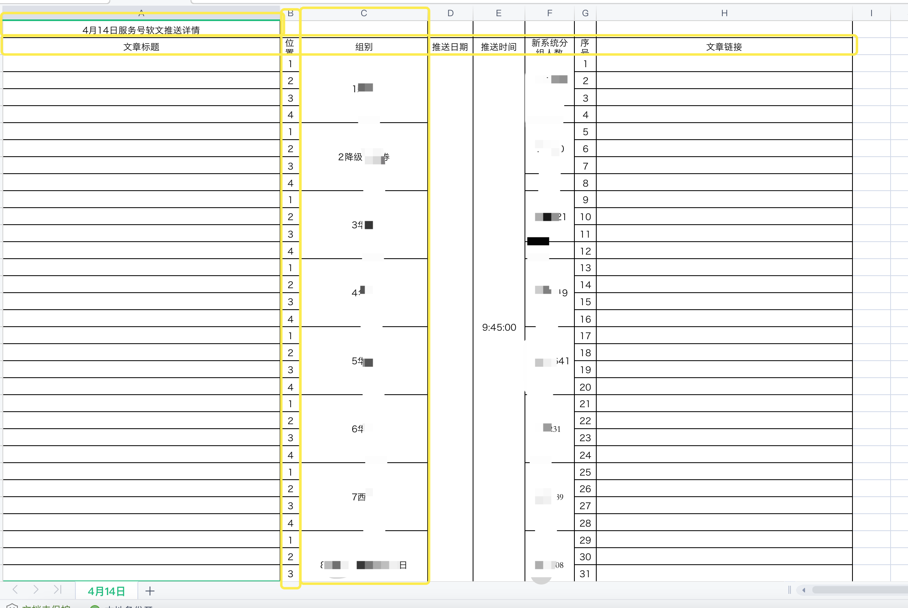
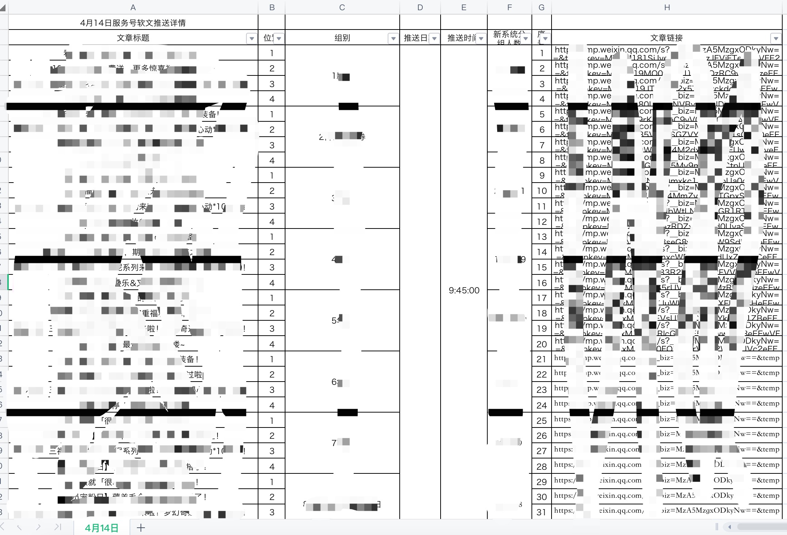
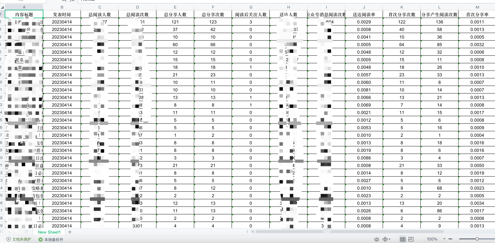
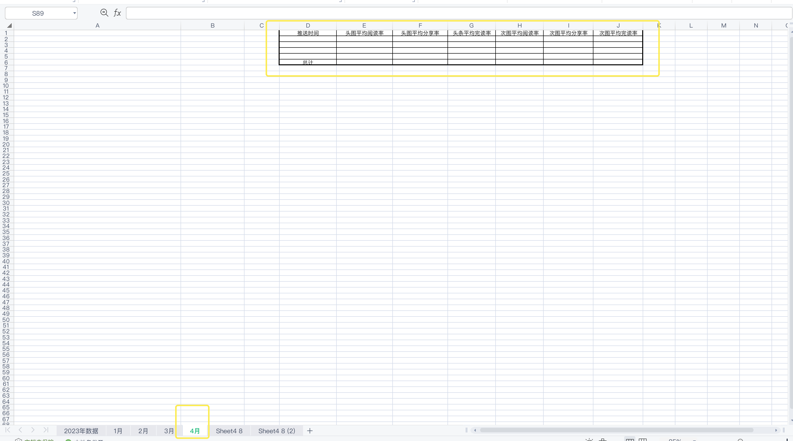
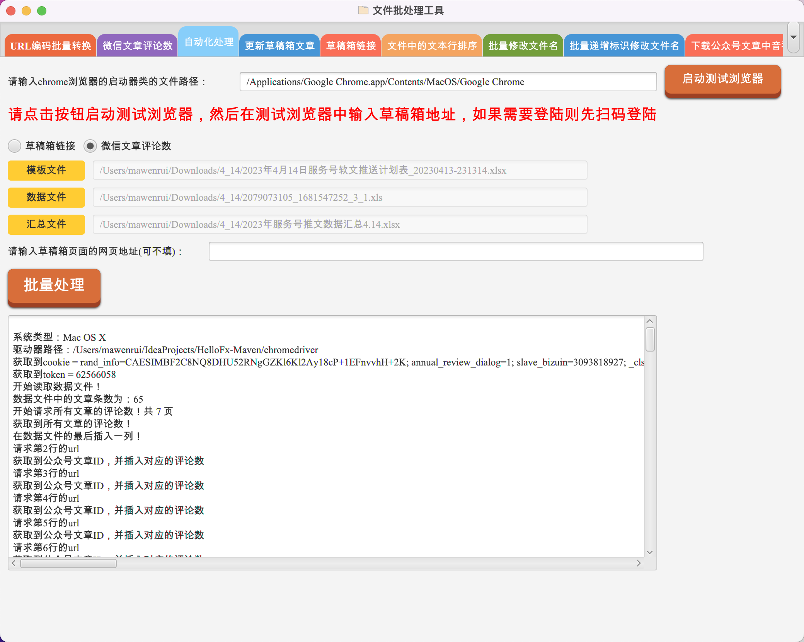
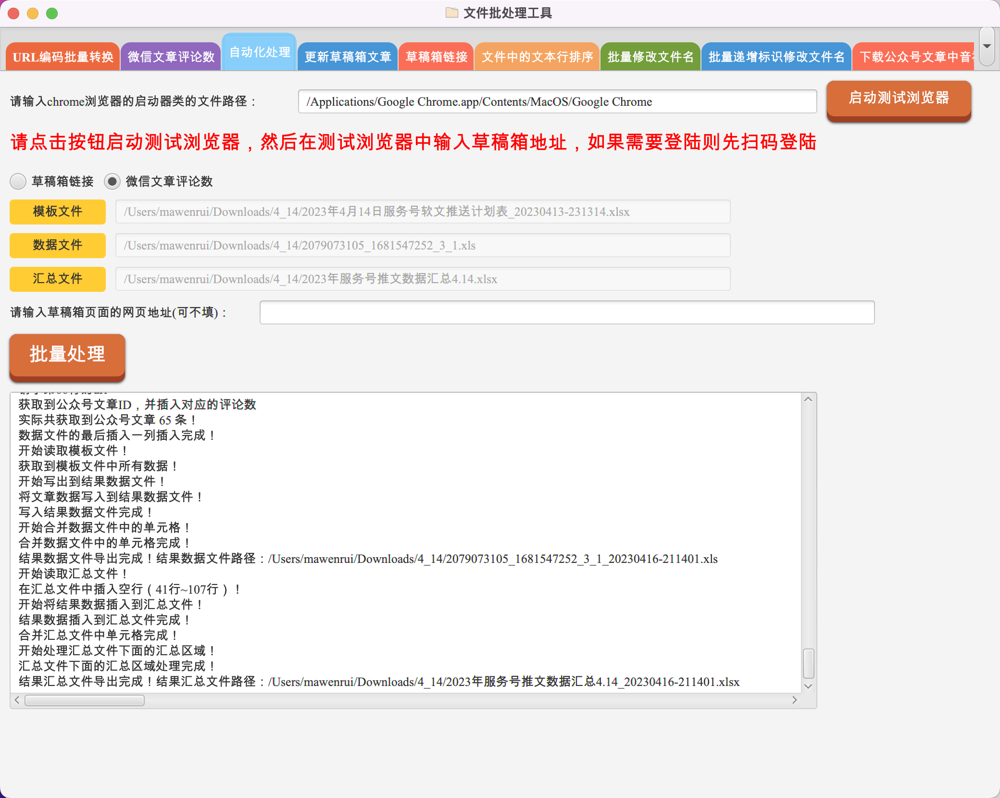
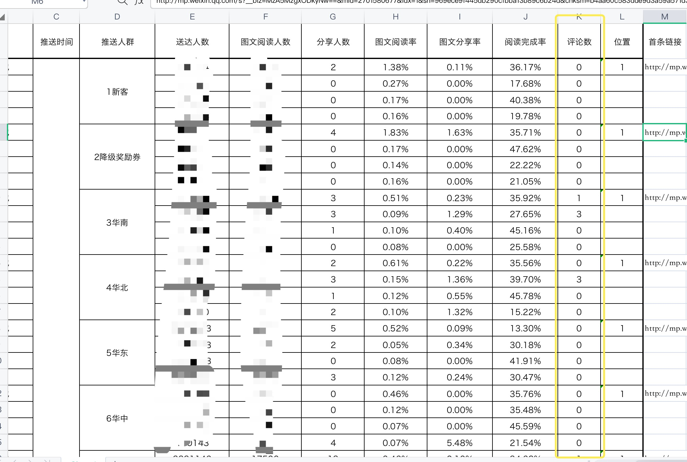
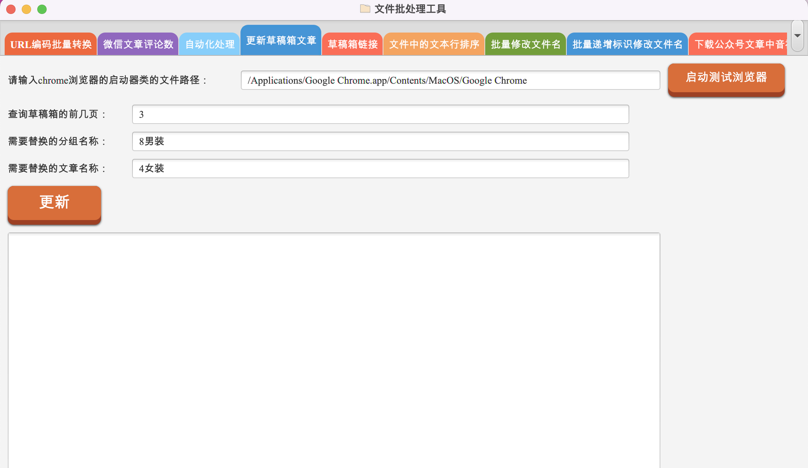

## javafx编写的电脑客户端的软件，协助日常的上班工作  
***[项目的GitHub路径](https://github.com/mwrmaven/HelloFx-Maven)***  
***[项目的Gitee路径](https://gitee.com/mwrmaven/HelloFx-Maven)***  
***github中的图片可能无法显示，可下载代码或跳转到Gitee路径查看README.md***
> ***软件中包含的功能***
>  * 自动化处理（获取草稿箱链接、获取微信文章评论数）
>  * 更新草稿箱文章
>  * 文件中的文本行排序
>  * URL编码批量转换
>  * 批量修改文件名
>  * 批量递增标识修改文件名
>  * 下载公众号文章中的音视频
>  * 比较两个文件内容
>  * 文本批量生成

### 功能介绍  
#### ***一、微信公众号草稿箱链接、微信文章评论数的自动化处理***

> * 自动点击浏览器获取指定分组的草稿箱链接功能
> 
> 1、找到Chrome浏览器的安装包路径下启动器类的文件路径，粘贴到"启动测试浏览器"按钮左侧的输入框；
> 
> 2、点击"启动测试浏览器"按钮，将弹出的浏览器窗口放大到最大，登陆进入微信公众号平台； 
> 
> 3、选中"草稿箱链接"单选按钮；
> 
> 4、在excel表格中列明公众号文章分组的关键字等信息，excel表格模板如下
> 
> 
> 5、点击"模板文件"，选中上一步骤中的excel模板文件；
> 
> 
> 6、点击"批量处理"按钮，***然后放开鼠标、键盘，让电脑自己飞一会儿***；
> 
> 7、处理完成后的数据文件如下：
> 

> * 自动点击浏览器获取微信公众号文章评论数功能
> 
> 1、找到Chrome浏览器的安装包路径下启动器类的文件路径，粘贴到"启动测试浏览器"按钮左侧的输入框；
>
> 2、点击"启动测试浏览器"按钮，将弹出的浏览器窗口放大到最大，登陆进入微信公众号平台；
>
> 3、选中"微信文章评论数"单选按钮；
> 
> 4、在模板文件中列明文章标题、位置、组别、新系统分组人数等信息（注：该模板文件只比"草稿箱链接"功能生成的文件多一列"标题类型"）
> 
> 
> 5、从微信公众号平台下载需要统计的时间段的数据文件，如下：
> 
> 软件会根据"内容标题"、"送达人数"列与上一步骤中的模板文件数据进行匹配；
> 
> 6、在汇总文件中标明对应月份的sheet页名称，在表格中提前列出汇总部分的数据（注：页面中黄线标明部分）
> 
> 
> 7、分别点击"模板文件"、"数据文件"、"汇总文件"按钮，选中对应的excel文件；
> 
> 
> 8、点击"批量处理"按钮，软件下方的文本区域会显示程序的执行进度，如果卡住，则重新点击"批量处理"按钮，重新执行程序；
> 
> 正常的执行过程如下：
> 
> 
> 执行后的汇总结果文件如下：
> 

#### ***二、微信公众号草稿箱文章新增、替换的自动化处理***

> 该功能可以使用草稿箱中修改后的afterA文章，替换目标分组中的preA文章
>
> 1、找到Chrome浏览器的安装包路径下启动器类的文件路径，粘贴到"启动测试浏览器"按钮左侧的输入框；
>
> 2、点击"启动测试浏览器"按钮，将弹出的浏览器窗口放大到最大，登陆进入微信公众号平台；
>
> 3、确认要查询草稿箱的前几页，并填入数字（例如要替换的新文章和要被替换的旧文章在前3页，则在这里输入3），如下：
> 
> 
> 4、找到需要替换的旧文章所在的分组名（即头条名称）,以及要更新的文章名称
> 
> ***注意:***
> 
> ***1、头条名称不可重复，如果有重复的，该功能无法使用）***
> 
> ***2、更新后的文章需要单独一组***
> 
> ***3、更新前后的文章名称需要一致***
> 
> 示例中的分组名：8男装；要更新的文章名：4女装
> 
> 
> 5、输入"需要替换的分组名称"、"需要替换的文章名称"，并点击"更新"按钮，***然后放开鼠标、键盘，让电脑自己飞一会儿***；
> 
> 
#### ***三、文件中的文本行排序***  

> 该功能可以为单个文件或文件夹下所有的文件的内容按行进行排序。
>
> 1、其中单文件或文件夹的选择按实际需求选择即可。
>
> 2、查找行中排序关键字的方式，分为分隔符方式查找和字符范围查找；
>
> * 分隔符方式查找意为以某个关键字符为准，将数据行进行分割成一段一段的，例如：  
>   
> 上图中的行数据使用“|”进行分割后，再指定关键字位置，例如关键字位置为 2，以此进行排序，
> 得到的结果如下图：  
> 
>
> * 字符范围查找意为根据开始字符和结束字符找到指定的字符范围，并以该范围内的字符进行排序；  
> 仍以上面的数据为例：  
>   
> 指定字符的开始位置为4，结束位置为5，即“30”、“50”、“40”所在的列，进行排序，得到结果如下图：  
>   
>
> 3、按需选择关键字的排序方式；
>
> 4、结果文件路径与原文件的相同，结果文件名称为“原文件名称_new.xxx”；  

#### ***四、URL编码批量转换***  

> 该功能主要将正常的字符串转换为url编码格式 或者 将url编码格式的字符串解码为正常字符串；
> 
> 1、源数据分为'单个url转换'、'单个文件中url批量转换'、'文件夹下所有文件中url批量转换'；
> 
> 2、其中'单个url转换'是直接在输入框中输入单条源数据；  
> 当输入单个url时，可以直接点击'批量处理'对源数据进行编解码；  
> 如图所示：
> 
> 
> 3、另外两个为选择包含多条源数据的文件或文件夹，这里以'单个文件中url批量转换'功能为例；  
> * 获取文件或选择文件夹路径部分，直接点击选择源文件(夹)即可；
> * 在选择源文件之后，需要指定源文件的格式；  
> 如果选择excel格式文件，则需要指定url所在的列；  
> 同时可以选择需要从excel文件中拷贝出来的列；  
> 如图所示：  
>   
> * 编译前字url后面追加的固定字符(在后置字符前)，例如设置为 a；
> 编译前在url上追加的字符：前置字符，例如设置为 b；后置字符，例如设置为 c；  
> 则编译前的源数据会拼接为：b源数据ac
> * 编译后在url前面追加的固定字符(在前置字符前)，例如设置为 j；  
> 编译后在url上追加的字符：前置字符，例如设置为 k；后置字符，例如设置为 m；  
> 则编译后的数据会拼接为：jk编译后的数据m  
> * '删除选中项'功能可以删除编译前在url后面追加的固定字符的记录；
> 注意，这里需要先选择下拉框中要删除的数据，再点击'删除选中项'按钮；
> 
> 4、选择模板文件部分  
> 处理后的结果可以按要求输出到指定的模板文件，模板文件中的变量使用 ${变量} 的方式表示； 
> 模板中的文本可以设置'底色'、'字体'、'字体颜色'等，输出的结果文件会按模板样式输出； 
> 例如：  
>   
> 模板中的文本内容如下：
>   
> 注意：
> * 模板文件中的 ${原URL} 和 ${处理后的URL} 为固定的源数据和转换后的数据；  
> * 其余的变量名称需要和'请选择需要拷贝出来的列（可多选）'中选择的列名对应；

#### ***五、批量修改文件名***  
  
> 该功能可以批量修改指定文件夹下匹配到的文件的名称；  
> * 选择指定的文件夹（即要修改的文件的所属文件夹）；
> * 输入文件名称中的旧字符，以及要替换旧字符的新字符；  
> 
> * 点击'批量修改后'，效果为：  
> 原文件夹下的源文件如图：  
>   
> 执行批量修改操作后如图：
>   
> **注意：这里只会修改可以匹配到旧字符的文件名称，而未匹配到的文件名称不会被修改。**

#### ***六、批量递增标识修改文件名***  
  
> 该功能是在'批量修改文件名'功能上的更新，可以指定一定的规律来修改文件名称；
> * '文件名中插入或替换'可以选择后置插入（在文件名末尾添加信息）、
> 前置插入（在文件名开头添加信息）、替换字符（替换文件名中的字符）；
> * 该功能中可以选择'根据模板文件创建新文件'或'只替换文件名'；  
> 如果选择根据模板文件创建文件，则需要选择模板文件，而对文件名的操作则是根据模板文件名为基础进行操作的；  
> 如果选择只替换文件名，则只会操作指定文件夹下现有的文件的文件名，不会创建新文件；  
> * 初始标识符的类型指的在文件名中替换或插入的基准标识符，当前只有数字和时间两种类型；
> * 递增标识的配置是在初始标识符的基础上做的扩展以及按规律的变更，如图：  
>   
> 图中配置的：后置插入、只替换文件名、初始标识符为数字类型、初始字符3，
> 初始字符的前置字符pre，初始字符的后置字符after，初始字符的步长 1；  
> 修改前的源文件图：  
>   
> 修改后的效果图：  
>   

#### ***七、下载公众号文章中的音视频***  
  
> 该功能可以从公众号文章中自动或者音频、视频，并下载（当前功能只能下载简单路径的音视频，复杂路径的音视频暂时无法处理）；  
> * 将公众号的链接添加到'请输入公众号文章的url'输入框中；
> * 选择保存音视频的文件夹路径；  
> 如图所示：  
>   

#### ***八、比较两个文件的内容***  
  
> 该功能可以比较两个文件中的文本的不同
> * 注意：  
> 1、当前只支持txt和doc、docx三种文本格式；  
> 2、只比较文件中的文本内容；
> * 根据需求选择两个文件，点击'比较'，不同的文本会标红显示；   
> 如图所示：
>   

#### ***九、文本批量生成***  
  
> 该功能可以根据文本模板批量生成文本信息；  
> * 在文本模板输入框中，输入需要批量生成的文本，其中包含的动态文本部分使用文本参数替代；  
> 如图所示：  
>   
> 其中参数使用 ${xxx} 的格式配置，图中的文本参数为 ${param1}、${param2}；  
> * 点击配置文本参数，可以自动抓取到文本模板中的参数，然后对不同的文本参数配置不同的参数值；  
> 例如：批量生成10个文本，则需要在参数值中输入你所需要的10个动态值，多个值之间用**英文逗号**分隔;  
> **注意：当配置多个文本参数时，每个文本参数的参数值个数需要一致**；  
> 如图所示：  
>   
> * 选择结果文件的输出路径；
> 功能示例：  
> 