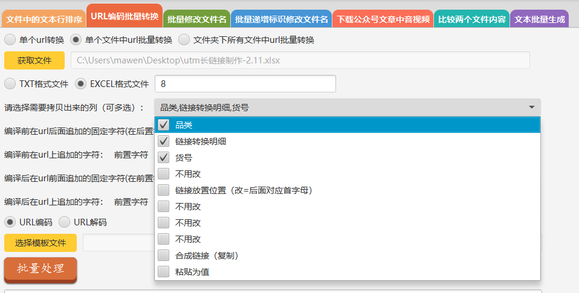

##javafx编写的电脑客户端的软件，协助日常的上班工作
> ***软件中包含的功能***
>  * 文件中的文本行排序
>  * URL编码批量转换
>  * 批量修改文件名
>  * 批量递增标识修改文件名
>  * 下载公众号文章中的音视频
>  * 比较两个文件内容
>  * 文本批量生成

###功能介绍
***一、文件中的文本行排序***

> 该功能可以为单个文件或文件夹下所有的文件的内容按行进行排序。
>
> 1、其中单文件或文件夹的选择按实际需求选择即可。
>
> 2、查找行中排序关键字的方式，分为分隔符方式查找和字符范围查找；
>
> * 分隔符方式查找意为以某个关键字符为准，将数据行进行分割成一段一段的，例如：  
>   
> 上图中的行数据使用“|”进行分割后，再指定关键字位置，例如关键字位置为 2，以此进行排序，
> 得到的结果如下图：  
> 
>
> * 字符范围查找意为根据开始字符和结束字符找到指定的字符范围，并以该范围内的字符进行排序；  
> 仍以上面的数据为例：  
>   
> 指定字符的开始位置为4，结束位置为5，即“30”、“50”、“40”所在的列，进行排序，得到结果如下图：  
>   
>
> 3、按需选择关键字的排序方式；
>
> 4、结果文件路径与原文件的相同，结果文件名称为“原文件名称_new.xxx”；  

***二、URL编码批量转换***

> 该功能主要将正常的字符串转换为url编码格式 或者 将url编码格式的字符串解码为正常字符串；
> 
> 1、源数据分为'单个url转换'、'单个文件中url批量转换'、'文件夹下所有文件中url批量转换'；
> 
> 2、其中'单个url转换'是直接在输入框中输入单条源数据；  
> 当输入单个url时，可以直接点击'批量处理'对源数据进行编解码；  
> 如图所示：
> 
> 
> 3、另外两个为选择包含多条源数据的文件或文件夹，这里以'单个文件中url批量转换'功能为例；  
> * 获取文件或选择文件夹路径部分，直接点击选择源文件(夹)即可；
> * 在选择源文件之后，需要指定源文件的格式；  
> 如果选择excel格式文件，则需要指定url所在的列；  
> 同时可以选择需要从excel文件中拷贝出来的列；  
> 如图所示：  
>   
> * 编译前字url后面追加的固定字符(在后置字符前)，例如设置为 a；
> 编译前在url上追加的字符：前置字符，例如设置为 b；后置字符，例如设置为 c；  
> 则编译前的源数据会拼接为：b源数据ac
> * 编译后在url前面追加的固定字符(在前置字符前)，例如设置为 j；  
> 编译后在url上追加的字符：前置字符，例如设置为 k；后置字符，例如设置为 m；  
> 则编译后的数据会拼接为：jk编译后的数据m  
> * '删除选中项'功能可以删除编译前在url后面追加的固定字符的记录；
> 注意，这里需要先选择下拉框中要删除的数据，再点击'删除选中项'按钮；
> 
> 4、选择模板文件部分  
> 处理后的结果可以按要求输出到指定的模板文件，模板文件中的变量使用 ${变量} 的方式表示；  
> 例如：  
>   
> 模板中的文本内容如下：
>   
> 注意：
> * 模板文件中的 ${原URL} 和 ${处理后的URL} 为固定的源数据和转换后的数据；  
> * 其余的变量名称需要和'请选择需要拷贝出来的列（可多选）'中选择的列名对应；
> 

